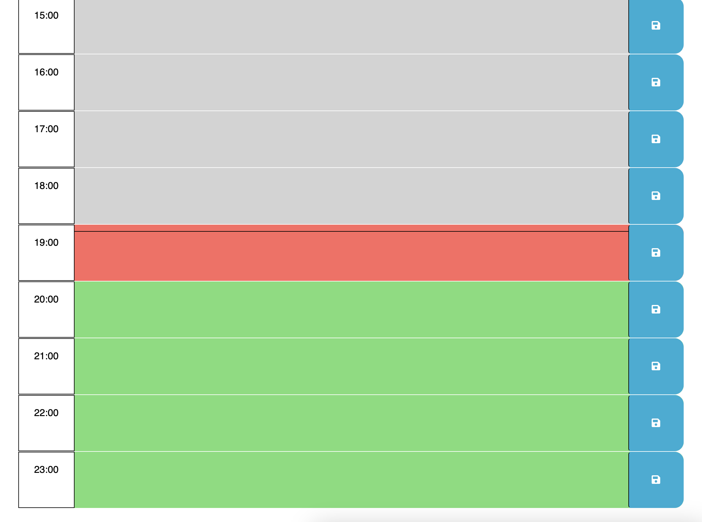

# Work Day Scheduler Starter Code
# Day Planner

## Table of Contents

* [Description](#description)
* [User Story](#user-story)
* [Acceptance Criteria](#acceptance-criteria)
* [Technologies Used](#technologies-used)
* [Developer](#developer)
* [Links](#link-to-application)

## Description
This day planner saves your tasks in the time blocks you choose. It marks the current hour, the current time, and by default takes you to the current time. There is also a button on the top of the page that navigates you to the current time. Tasks can be saved using the save button on the right of each block. The text most recently saved in a block will remain, overwriting previous text.

## User Story
AS AN employee with a busy schedule
I WANT to add important events to a daily planner
SO THAT I can manage my time effectively

## Acceptance Criteria

GIVEN I am using a daily planner to create a schedule
WHEN I open the planner
THEN the current day is displayed at the top of the calendar
WHEN I scroll down
THEN I am presented with time blocks for standard business hours of 9am to 5pm
WHEN I view the time blocks for that day
THEN each time block is color-coded to indicate whether it is in the past, present, or future
WHEN I click into a time block
THEN I can enter an event
WHEN I click the save button for that time block
THEN the text for that event is saved in local storage
WHEN I refresh the page
THEN the saved events persist

## Technologies Used

Built with:
* HTML5
* CSS
* JavaScript

## Developer
* Adam Hussain

## Link to Application
https://adamh1223.github.io/module-3-challenge/

## Link to GitHub Repository
https://github.com/adamh1223/day-planner

### 
[Back to Top](#day-planner)
 
